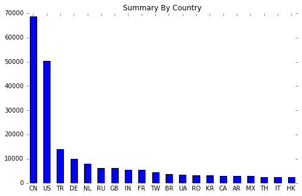
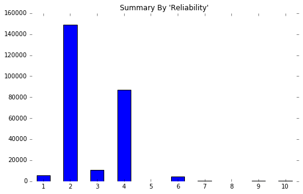
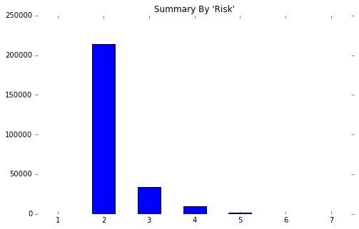
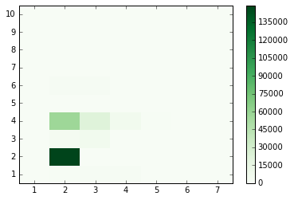
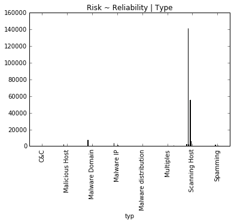
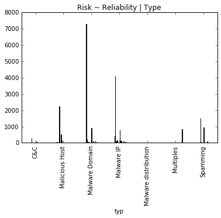
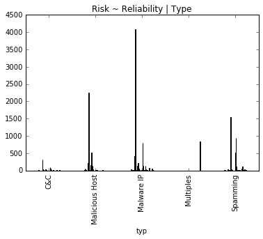

# Python
## Listing 3-1

Listing 3-1 demonstrates how the os library can be imported to a python script to use functions like chdir and path.expanduser to set the working directory.  In python, libraries for graphics are pandas and numpy.


```python
%matplotlib inline
import os
os.chdir(os.path.expanduser("~") + "/Documents/Class Notes and Assignments/SRT411/SRT411-DataAnalysisLab-2/")
```

## Listing 3-3

Listing 3-3 shows how the os and urllib library can be imported into a python code to retrieve the database and save it in a similar fashion, if it does not already exist in the data repository.


```python
import urllib
import os.path

avURL = "http://datadrivensecurity.info/book/ch03/data/reputation.data"
avRep = "data/reputation.data"
if not os.path.isfile(avRep) :
    urllib.urlretrieve(avURL, filename = avRep)
```

## Listing 3-5

Listing 3-5 uses the pandas library to convert the # separated values into a data frame.


```python
import pandas as pd
import sys
av = pd.read_csv(avRep,sep="#")

av.columns = ["IP","Reliability","Risk","Type","Country","Locale","Coord","x"]
print(av)
```

                         IP  Reliability  Risk            Type Country  \
    0        222.76.212.185            4     2   Scanning Host      CN   
    1        222.76.212.186            4     2   Scanning Host      CN   
    2           5.34.246.67            6     3        Spamming      US   
    3         178.94.97.176            4     5   Scanning Host      UA   
    4           66.2.49.232            4     2   Scanning Host      US   
    5        222.76.212.173            4     2   Scanning Host      CN   
    6        222.76.212.172            4     2   Scanning Host      CN   
    7        222.76.212.171            4     2   Scanning Host      CN   
    8         174.142.46.19            6     3        Spamming     NaN   
    9           66.2.49.244            4     2   Scanning Host      US   
    10         62.75.130.16            4     2   Scanning Host      DE   
    11         62.75.130.17            4     2   Scanning Host      DE   
    12         62.75.130.18            4     2   Scanning Host      DE   
    13         62.75.130.19            4     2   Scanning Host      DE   
    14       112.216.121.87            4     3   Scanning Host      KR   
    15       112.216.121.78            4     3   Scanning Host      KR   
    16       112.216.121.77            4     3   Scanning Host      KR   
    17       112.216.121.75            4     3   Scanning Host      KR   
    18       112.216.121.74            4     3   Scanning Host      KR   
    19        222.45.58.249            4     2   Scanning Host      CN   
    20        222.45.58.244            4     2   Scanning Host      CN   
    21       120.31.136.119            4     2   Scanning Host      CN   
    22         201.57.0.248            4     2   Scanning Host      BR   
    23         218.65.30.37            4     4   Scanning Host      CN   
    24         218.65.30.38            4     3   Scanning Host      CN   
    25         178.94.97.59            4     5   Scanning Host      UA   
    26       84.241.180.134            6     3      Malware IP      NL   
    27         62.75.130.12            4     2   Scanning Host      DE   
    28         62.75.130.13            4     2   Scanning Host      DE   
    29         62.75.130.14            4     2   Scanning Host      DE   
    ...                 ...          ...   ...             ...     ...   
    258595    78.27.127.220            4     2   Scanning Host      FI   
    258596    78.27.127.210            4     2   Scanning Host      FI   
    258597     78.188.27.29            1     2   Scanning Host      TR   
    258598      223.4.10.45            6     2  Malware Domain      CN   
    258599      221.6.207.4            4     3   Scanning Host      CN   
    258600     78.27.127.51            4     2   Scanning Host      FI   
    258601     78.27.127.57            4     2   Scanning Host      FI   
    258602     78.188.27.26            1     2   Scanning Host      TR   
    258603     78.188.27.27            1     2   Scanning Host      TR   
    258604   60.168.158.231            4     4   Scanning Host      CN   
    258605     78.188.27.28            1     2   Scanning Host      TR   
    258606  180.215.161.174            4     4   Scanning Host      IN   
    258607    78.27.127.211            4     2   Scanning Host      FI   
    258608   190.229.178.34            4     3   Scanning Host      AR   
    258609   190.229.178.37            4     3   Scanning Host      AR   
    258610  190.229.178.155            4     3   Scanning Host      AR   
    258611     78.27.127.48            4     2   Scanning Host      FI   
    258612      23.83.79.89            9     2  Malware Domain     NaN   
    258613  188.190.124.120            6     3  Malware Domain      UA   
    258614     78.27.127.50            4     2   Scanning Host      FI   
    258615     78.27.127.47            4     2   Scanning Host      FI   
    258616     75.98.171.83            4     2        Spamming      US   
    258617   114.112.189.27            4     2   Scanning Host      CN   
    258618  114.112.189.139            4     2   Scanning Host      CN   
    258619  173.208.220.245            9     2        Spamming      US   
    258620  179.244.194.219            4     2        Spamming      BR   
    258621   216.99.159.166            4     2   Scanning Host      US   
    258622   216.99.159.169            3     2   Scanning Host      US   
    258623   216.99.159.176            3     2   Scanning Host      US   
    258624   216.99.159.117            3     3   Scanning Host      US   
    
                 Locale                          Coord   x  
    0            Xiamen     24.4797992706,118.08190155  11  
    1            Xiamen     24.4797992706,118.08190155  11  
    2               NaN                     38.0,-97.0  12  
    3            Merefa    49.8230018616,36.0507011414  11  
    4        Union City   37.5962982178,-122.065696716  11  
    5            Xiamen     24.4797992706,118.08190155  11  
    6            Xiamen     24.4797992706,118.08190155  11  
    7            Xiamen     24.4797992706,118.08190155  11  
    8               NaN     24.4797992706,118.08190155  12  
    9        Union City   37.5962982178,-122.065696716  11  
    10              NaN                       51.0,9.0  11  
    11              NaN                       51.0,9.0  11  
    12              NaN                       51.0,9.0  11  
    13              NaN                       51.0,9.0  11  
    14              NaN                     37.0,127.5  11  
    15              NaN                     37.0,127.5  11  
    16              NaN                     37.0,127.5  11  
    17              NaN                     37.0,127.5  11  
    18              NaN                     37.0,127.5  11  
    19          Nanjing    32.0616989136,118.777801514  11  
    20          Nanjing    32.0616989136,118.777801514  11  
    21           Foshan    23.0268001556,113.131500244  11  
    22              NaN                    -10.0,-55.0  11  
    23         Nanchang    28.5499992371,115.933296204  11  
    24         Nanchang    28.5499992371,115.933296204  11  
    25           Merefa    49.8230018616,36.0507011414  11  
    26              NaN                      52.5,5.75   7  
    27              NaN                       51.0,9.0  11  
    28              NaN                       51.0,9.0  11  
    29              NaN                       51.0,9.0  11  
    ...             ...                            ...  ..  
    258595     Helsinki    60.1755981445,24.9342002869  11  
    258596     Helsinki    60.1755981445,24.9342002869  11  
    258597     Istanbul    41.0186004639,28.9647006989  11  
    258598      Beijing    39.9289016724,116.388298035   6  
    258599      Nanjing    32.0616989136,118.777801514  11  
    258600     Helsinki    60.1755981445,24.9342002869  11  
    258601     Helsinki    60.1755981445,24.9342002869  11  
    258602     Istanbul    41.0186004639,28.9647006989  11  
    258603     Istanbul    41.0186004639,28.9647006989  11  
    258604        Hefei     31.863899231,117.280799866  11  
    258605     Istanbul    41.0186004639,28.9647006989  11  
    258606          NaN                      20.0,77.0  11  
    258607     Helsinki    60.1755981445,24.9342002869  11  
    258608      Tucuman  -26.8241004944,-65.2226028442  11  
    258609      Tucuman  -26.8241004944,-65.2226028442  11  
    258610      Tucuman  -26.8241004944,-65.2226028442  11  
    258611     Helsinki    60.1755981445,24.9342002869  11  
    258612          NaN    60.1755981445,24.9342002869   6  
    258613      Kharkov    49.9808006287,36.2527008057   6  
    258614     Helsinki    60.1755981445,24.9342002869  11  
    258615     Helsinki    60.1755981445,24.9342002869  11  
    258616    Ann Arbor   42.2775993347,-83.7408981323  12  
    258617      Beijing    39.9289016724,116.388298035  11  
    258618      Beijing    39.9289016724,116.388298035  11  
    258619  Kansas City   39.1068000793,-94.5660018921  12  
    258620          NaN                    -10.0,-55.0  12  
    258621       Walnut   34.0115013123,-117.853500366  11  
    258622       Walnut   34.0115013123,-117.853500366  11  
    258623       Walnut   34.0115013123,-117.853500366  11  
    258624       Walnut   34.0115013123,-117.853500366  11  
    
    [258625 rows x 8 columns]
    


```python
av.head().to_csv(sys.stdout)
```

    ,IP,Reliability,Risk,Type,Country,Locale,Coord,x
    0,222.76.212.185,4,2,Scanning Host,CN,Xiamen,"24.4797992706,118.08190155",11
    1,222.76.212.186,4,2,Scanning Host,CN,Xiamen,"24.4797992706,118.08190155",11
    2,5.34.246.67,6,3,Spamming,US,,"38.0,-97.0",12
    3,178.94.97.176,4,5,Scanning Host,UA,Merefa,"49.8230018616,36.0507011414",11
    4,66.2.49.232,4,2,Scanning Host,US,Union City,"37.5962982178,-122.065696716",11
    

## Listing 3-6

Listing 3-6 demonstrates how the dataframe can be displayed in a more aesthetic HTML format by importing HTML from the IPython.display library.


```python
from IPython.display import HTML
HTML(av.head().to_html())
```


<table border="1" class="dataframe">
  <thead>
    <tr style="text-align: right;">
      <th></th>
      <th>IP</th>
      <th>Reliability</th>
      <th>Risk</th>
      <th>Type</th>
      <th>Country</th>
      <th>Locale</th>
      <th>Coord</th>
      <th>x</th>
    </tr>
  </thead>
  <tbody>
    <tr>
      <th>0</th>
      <td>222.76.212.185</td>
      <td>4</td>
      <td>2</td>
      <td>Scanning Host</td>
      <td>CN</td>
      <td>Xiamen</td>
      <td>24.4797992706,118.08190155</td>
      <td>11</td>
    </tr>
    <tr>
      <th>1</th>
      <td>222.76.212.186</td>
      <td>4</td>
      <td>2</td>
      <td>Scanning Host</td>
      <td>CN</td>
      <td>Xiamen</td>
      <td>24.4797992706,118.08190155</td>
      <td>11</td>
    </tr>
    <tr>
      <th>2</th>
      <td>5.34.246.67</td>
      <td>6</td>
      <td>3</td>
      <td>Spamming</td>
      <td>US</td>
      <td>NaN</td>
      <td>38.0,-97.0</td>
      <td>12</td>
    </tr>
    <tr>
      <th>3</th>
      <td>178.94.97.176</td>
      <td>4</td>
      <td>5</td>
      <td>Scanning Host</td>
      <td>UA</td>
      <td>Merefa</td>
      <td>49.8230018616,36.0507011414</td>
      <td>11</td>
    </tr>
    <tr>
      <th>4</th>
      <td>66.2.49.232</td>
      <td>4</td>
      <td>2</td>
      <td>Scanning Host</td>
      <td>US</td>
      <td>Union City</td>
      <td>37.5962982178,-122.065696716</td>
      <td>11</td>
    </tr>
  </tbody>
</table>


## Listing 3-8

The describe function is the python version of the 5 number summary from R.  It outputs the medians of the first, second, and third quartiles, as well as the mean, min, max, and standard deviation of the data.


```python
av['Reliability'].describe()
```


    count    258625.000000
    mean          2.798036
    std           1.130419
    min           1.000000
    25%           2.000000
    50%           2.000000
    75%           4.000000
    max          10.000000
    Name: Reliability, dtype: float64


```python
av['Risk'].describe()
```


    count    258625.000000
    mean          2.221363
    std           0.531572
    min           1.000000
    25%           2.000000
    50%           2.000000
    75%           2.000000
    max           7.000000
    Name: Risk, dtype: float64


## Listing 3-10
The count of each categorical value is aggregated and reorganized in contextual order e.g. factor level where 2 implies that it is a greater ranking than one, but not necessarily in quantity.


```python
def factor_col(col) :
    factor = pd.Categorical(col)
    return pd.value_counts(factor,sort=True).reindex(factor.categories.tolist())
    #return pd.value_counts(factor, sort=True).reindex(factor.select_dtypes['category'])
print factor_col(av['Reliability'])

```

    1       5612
    2     149117
    3      10892
    4      87039
    5          7
    6       4758
    7        297
    8         21
    9        686
    10       196
    dtype: int64
    


```python
print factor_col(av['Risk'])
```

    1        39
    2    213851
    3     33719
    4      9588
    5      1328
    6        90
    7        10
    dtype: int64
    


```python
print factor_col(av['Type']).head(n=10)
```

    APT;Malware Domain                  1
    C&C                               610
    C&C;Malware Domain                 31
    C&C;Malware IP                     20
    C&C;Scanning Host                   7
    Malicious Host                   3770
    Malicious Host;Malware Domain       4
    Malicious Host;Malware IP           2
    Malicious Host;Scanning Host      163
    Malware Domain                   9274
    dtype: int64
    


```python
print factor_col(av['Country']).head(n=10)
```

    A1     267
    A2       2
    AE    1827
    AL       4
    AM       6
    AN       3
    AO     256
    AR    3046
    AT      51
    AU     155
    dtype: int64
    

## Listing 3-14
It is possible to plot the count of 20 countries as a bar graph, in descending order, using the matplotlib.pyplot library.  We use this do determine which contry accounts for the most malicious nodes.  We further investigate the dataframe by graphing the Reliability and Risk categorical value counts to get an overview of the characteristics of the majority of the nodes.


```python
import matplotlib.pyplot as plt
country_ct = pd.value_counts(av['Country'])
plt.axes(frameon=0)
country_ct[:20].plot(kind='bar', rot=0, title="Summary By Country", figsize=(8,5)).grid(False)
```





## Listing 3-15


```python
plt.axes(frameon=0)
factor_col(av['Reliability']).plot(kind='bar', rot=0, title="Summary By 'Reliability'", figsize=(8,5)).grid(False)
```





## Listed 3-16


```python
plt.axes(frameon=0)
factor_col(av['Risk']).plot(kind='bar', rot=0, title="Summary By 'Risk'", figsize=(8,5)).grid(False)
```





## Listing 3-18
The contribution of malicious nodes by countries can be reflected as a percentage output as well by dividing the value count of each country with the length of the factor.


```python
top10 = pd.value_counts(av['Country'])[0:9]
top10.astype(float) / len(av['Country'])
```


    CN    0.265179
    US    0.194826
    TR    0.053970
    DE    0.038484
    NL    0.030666
    RU    0.024537
    GB    0.024333
    IN    0.021189
    FR    0.021069
    Name: Country, dtype: float64


## Listing 3-20
A numerical output of the count of nodes for each permutation of Risk~Reliability combination is made using the cm function from the pandas library.  Then, using numpy and cmap from mplotlib, you can produce a heatmap of the permutations to get a visual of where the majority of the data is concentrated.


```python
from matplotlib import cm
from numpy import arange
pd.crosstab(av['Risk'], av['Reliability'])
```


<div>
<table border="1" class="dataframe">
  <thead>
    <tr style="text-align: right;">
      <th>Reliability</th>
      <th>1</th>
      <th>2</th>
      <th>3</th>
      <th>4</th>
      <th>5</th>
      <th>6</th>
      <th>7</th>
      <th>8</th>
      <th>9</th>
      <th>10</th>
    </tr>
    <tr>
      <th>Risk</th>
      <th></th>
      <th></th>
      <th></th>
      <th></th>
      <th></th>
      <th></th>
      <th></th>
      <th></th>
      <th></th>
      <th></th>
    </tr>
  </thead>
  <tbody>
    <tr>
      <th>1</th>
      <td>0</td>
      <td>0</td>
      <td>16</td>
      <td>7</td>
      <td>0</td>
      <td>8</td>
      <td>8</td>
      <td>0</td>
      <td>0</td>
      <td>0</td>
    </tr>
    <tr>
      <th>2</th>
      <td>804</td>
      <td>149114</td>
      <td>3670</td>
      <td>57652</td>
      <td>4</td>
      <td>2084</td>
      <td>85</td>
      <td>11</td>
      <td>345</td>
      <td>82</td>
    </tr>
    <tr>
      <th>3</th>
      <td>2225</td>
      <td>3</td>
      <td>6668</td>
      <td>22168</td>
      <td>2</td>
      <td>2151</td>
      <td>156</td>
      <td>7</td>
      <td>260</td>
      <td>79</td>
    </tr>
    <tr>
      <th>4</th>
      <td>2129</td>
      <td>0</td>
      <td>481</td>
      <td>6447</td>
      <td>0</td>
      <td>404</td>
      <td>43</td>
      <td>2</td>
      <td>58</td>
      <td>24</td>
    </tr>
    <tr>
      <th>5</th>
      <td>432</td>
      <td>0</td>
      <td>55</td>
      <td>700</td>
      <td>1</td>
      <td>103</td>
      <td>5</td>
      <td>1</td>
      <td>20</td>
      <td>11</td>
    </tr>
    <tr>
      <th>6</th>
      <td>19</td>
      <td>0</td>
      <td>2</td>
      <td>60</td>
      <td>0</td>
      <td>8</td>
      <td>0</td>
      <td>0</td>
      <td>1</td>
      <td>0</td>
    </tr>
    <tr>
      <th>7</th>
      <td>3</td>
      <td>0</td>
      <td>0</td>
      <td>5</td>
      <td>0</td>
      <td>0</td>
      <td>0</td>
      <td>0</td>
      <td>2</td>
      <td>0</td>
    </tr>
  </tbody>
</table>
</div>


```python
xtab = pd.crosstab(av['Reliability'], av['Risk'])
plt.pcolor(xtab,cmap=cm.Greens)
plt.yticks(arange(0.5, len(xtab.index), 1),xtab.index)
plt.xticks(arange(0.5, len(xtab.columns), 1),xtab.columns)
plt.colorbar()
```


    <matplotlib.colorbar.Colorbar at 0x92af320>





## Listing 3-23
A three-way contingency table, relating Risk, Reliablility, and malicious node type and outputting it as a simple bargraph.


```python
av['newtype'] = av['Type']
av[av['newtype'].str.contains(";")] = "Multiples"
typ = av['newtype']
rel = av['Reliability']
rsk = av['Risk']
xtab = pd.crosstab(typ, [ rel, rsk ], rownames=['typ'], colnames=['rel', 'rsk'])
print xtab.to_string()
```

    rel                     1                               2      3                          4                                  5        6                        7                  8             9                     10            Multiples
    rsk                     2     3     4    5   6  7       2  3   1     2     3    4   5  6  1      2      3     4    5   6  7  2  3  5  1    2    3    4   5  6  1   2    3   4  5  2  3  4  5    2    3   4   5  6  7   2   3   4  5 Multiples
    typ                                                                                                                                                                                                                                          
    C&C                     0     0     1    2   1  0       0  0   0     0     0  313  22  2  0      0      0    15   22   4  1  0  0  1  0    0    0   98  60  5  0   0    0   7  3  0  0  1  1    0    0  19  16  1  1   0   1   8  5         0
    Malicious Host          0     6    51   41   8  1       0  0   1   206  2250    7   2  0  0    152    512   336  138  30  2  1  0  0  1    3    8    8   4  0  0   0    0   0  0  0  0  0  0    0    2   0   0  0  0   0   0   0  0         0
    Malware Domain         12     1     0    0   0  0    7309  0   2   246    55    2   1  0  0     60     18     2    0   0  0  2  1  0  2  921  273   26   2  0  3  72   13   0  0  7  1  1  0  135   38   6   0  0  0  54   7   2  0         0
    Malware IP              0    23    11   15  10  2       0  3  12   415  4091   71   6  0  1    132    205   122   45  13  2  0  1  0  3   10  793  133  11  3  5   0  140  35  0  0  6  0  0    1   74  10   0  0  0   0  53  11  2         0
    Malware distribution    0     0     0    0   0  0       0  0   0     0     1    0   0  0  0      0      0     0    0   0  0  0  0  0  0    0    0    0   0  0  0   0    0   0  0  0  0  0  0    0    0   0   0  0  0   0   0   0  0         0
    Multiples               0     0     0    0   0  0       0  0   0     0     0    0   0  0  0      0      0     0    0   0  0  0  0  0  0    0    0    0   0  0  0   0    0   0  0  0  0  0  0    0    0   0   0  0  0   0   0   0  0       834
    Scanning Host         790  2189  2056  366   0  0  141543  0   1  2685   159   35  13  0  6  55653  21325  5931  488  13  0  1  0  0  2  611  107   23   1  0  0   0    0   0  0  2  0  0  0  150   22   7   0  0  0   0   0   0  0         0
    Spamming                1     2     9    7   0  0       1  0   0    22     9   17   6  0  0   1536     40    21    4   0  0  0  0  0  0  512  931  106  17  0  0   4    1   0  2  1  0  0  0   52  120  15   3  0  0  24  17   3  4         0
    


```python
xtab.plot(kind='bar', legend=False, title="Risk ~ Reliability | Type").grid(False)
```





## Listing 3-25

The Scanning Host category is omitted since the majority of the nodes are concentrated there but have a negligable Risk~Reliability permutation.


```python
rrt_df = av[av['newtype'] !="Scanning Host"]
typ = rrt_df['newtype']
rel = rrt_df['Reliability']
rsk = rrt_df['Risk']
xtab = pd.crosstab(typ, [ rel, rsk ], rownames=['typ'], colnames=['rel', 'rsk'])
xtab.plot(kind='bar', legend=False, title="Risk ~ Reliability | Type").grid(False)
```





## Listing 3-27

The Malware distribution and Malware Domain are omitted since Malware Domain has no nodes, and Malware distribution has negligeable Risk~Reliability permutation.  A count of the nodes in the modified data shows that it accounts for 5.9% of all nodes.


```python
rrt_df = rrt_df[rrt_df['newtype'] != "Malware distribution" ]
rrt_df = rrt_df[rrt_df['newtype'] != "Malware Domain" ]
typ = rrt_df['newtype']
rel = rrt_df['Reliability']
rsk = rrt_df['Risk']
xtab = pd.crosstab(typ, [ rel, rsk ], rownames=['typ'], colnames=['rel', 'rsk'])
print "Count: %d; Percent: %2.1f%%" % (len(rrt_df), (float(len(rrt_df)) / len(av))  * 100)
```

    Count: 15171; Percent: 5.9%
    


```python
xtab.plot(kind='bar', legend=False, title="Risk ~ Reliability | Type").grid(False)
```




