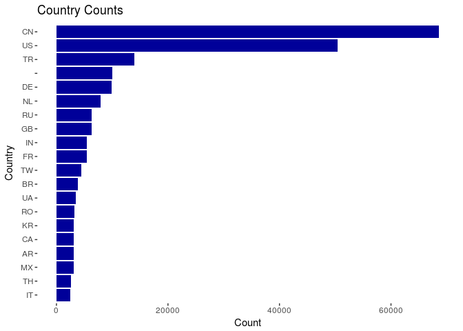
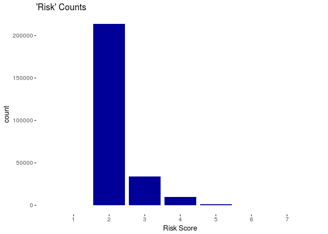
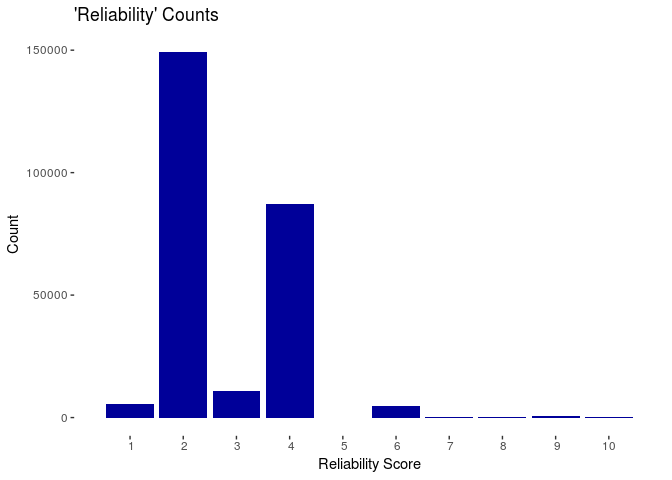
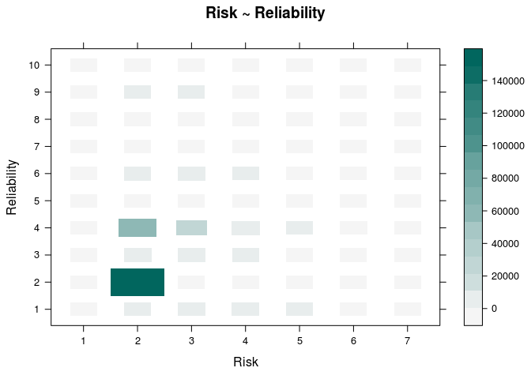
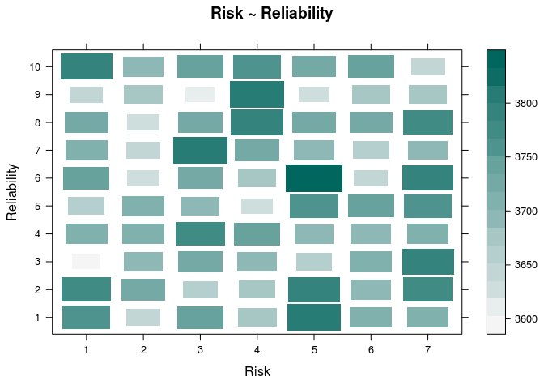
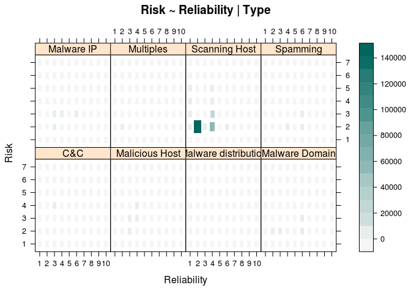
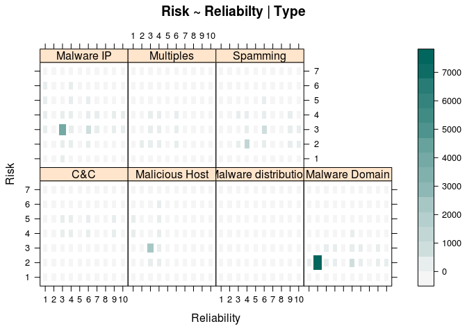
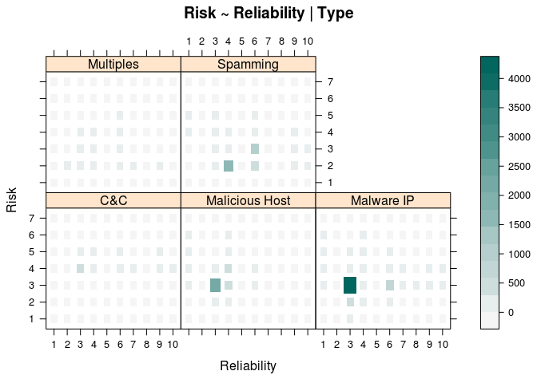

# DataAnalysisLab2
Joy Chowdhury  
February 3, 2017  


## Listing 3-0

Listing 3-0 demonstrates how the working directory can be set using R and how a vector of package names can be compared against installed packages to determine new packages to be installed, saving bandwidth and time.  The packages are used to create graphs and other visuals.


```r
setwd("~/Documents/SRT411/SRT411-DataAnalysisLab-2/")
pkg <- c("ggplot2", "scales", "maptools", "sp", "maps", "grid", "car")
new.pkg <- pkg[!(pkg %in% installed.packages())]
if (length(new.pkg)) {
  install.packages(new.pkg)
}
```

## Listing 3-2

Listing 3-2 uses an if statement to check whether a database exists, and then decides if it will use the download.file function to download a reputation database from the datadrivensecurity website to be saved in a subrepository of the working directory called data, as a file called reputation.data.


```r
avURL <- "http://datadrivensecurity.info/book/ch03/data/reputation.data"
avRep <- "data/reputation.data"
if (file.access(avRep)) {
  download.file(avURL, avRep)
}
```


## Listing 3-4

Listing 3-4 converts the # separated database into a dataframe using R, providing headers to the generated columns with the function colnames() and a vector of header strings.


```r
av <- read.csv(avRep, sep = "#", header = FALSE)
colnames(av) <- c("IP", "Reliability", "Risk", "Type", "Country", "Locale", "Coord", "X")
str(av)
```

```
## 'data.frame':	258626 obs. of  8 variables:
##  $ IP         : Factor w/ 258626 levels "1.0.232.167",..: 154069 154065 154066 171110 64223 197880 154052 154051 154050 56741 ...
##  $ Reliability: int  4 4 4 6 4 4 4 4 4 6 ...
##  $ Risk       : int  2 2 2 3 5 2 2 2 2 3 ...
##  $ Type       : Factor w/ 34 levels "APT;Malware Domain",..: 25 25 25 31 25 25 25 25 25 31 ...
##  $ Country    : Factor w/ 153 levels "","A1","A2","AE",..: 34 34 34 143 141 143 34 34 34 1 ...
##  $ Locale     : Factor w/ 2573 levels "","Aachen","Aarhus",..: 2506 2506 2506 1 1374 2342 2506 2506 2506 1 ...
##  $ Coord      : Factor w/ 3140 levels "-0.139500007033,98.1859970093",..: 489 489 489 1426 2676 1384 489 489 489 489 ...
##  $ X          : Factor w/ 34 levels "1;6","11","11;12",..: 2 2 2 8 2 2 2 2 2 8 ...
```

```r
head(av)
```

```
##               IP Reliability Risk          Type Country     Locale
## 1 222.76.212.189           4    2 Scanning Host      CN     Xiamen
## 2 222.76.212.185           4    2 Scanning Host      CN     Xiamen
## 3 222.76.212.186           4    2 Scanning Host      CN     Xiamen
## 4    5.34.246.67           6    3      Spamming      US           
## 5  178.94.97.176           4    5 Scanning Host      UA     Merefa
## 6    66.2.49.232           4    2 Scanning Host      US Union City
##                          Coord  X
## 1   24.4797992706,118.08190155 11
## 2   24.4797992706,118.08190155 11
## 3   24.4797992706,118.08190155 11
## 4                   38.0,-97.0 12
## 5  49.8230018616,36.0507011414 11
## 6 37.5962982178,-122.065696716 11
```


## Listing 3-7

Listing 3-7 displays the 5 number summary developed by Tukey.  It is used to determine the range(min and max), and the first and third percentiles, along with the median and mean, of each specified column..


```r
summary(av$Reliability)
```

```
##    Min. 1st Qu.  Median    Mean 3rd Qu.    Max. 
##   1.000   2.000   2.000   2.798   4.000  10.000
```

```r
summary(av$Risk)
```

```
##    Min. 1st Qu.  Median    Mean 3rd Qu.    Max. 
##   1.000   2.000   2.000   2.221   2.000   7.000
```

## Listing 3-9

Listing 3-9 demonstrates how the table() function in R can count values of quantitative variables for a column in a dataframe.  Essentially, categorical data is aggregated and the count of each unique data is displayed.  It also shows the difference betwen table() and summary().  Summary organizes the malware qualitative data by aggregating each unique string and counting the number of times they appear


```r
table(av$Reliability)
```

```
## 
##      1      2      3      4      5      6      7      8      9     10 
##   5612 149117  10892  87040      7   4758    297     21    686    196
```

```r
table(av$Risk)
```

```
## 
##      1      2      3      4      5      6      7 
##     39 213852  33719   9588   1328     90     10
```


```r
summary(av$Type, maxsum=10)
```

```
##                Scanning Host               Malware Domain 
##                       234180                         9274 
##                   Malware IP               Malicious Host 
##                         6470                         3770 
##                     Spamming                          C&C 
##                         3487                          610 
## Scanning Host;Malicious Host    Malware Domain;Malware IP 
##                          215                          173 
## Malicious Host;Scanning Host                      (Other) 
##                          163                          284
```


```r
summary(av$Country, maxsum=10)
```

```
##      CN      US      TR              DE      NL      RU      GB      IN 
##   68583   50387   13958   10055    9953    7931    6346    6293    5480 
## (Other) 
##   79640
```

##Listing 3-11

Listing 3-11 demonstrates the capabilities of ggplot2 library by creating a bar graph of the Country statistics in the dataset.


```r
library(ggplot2)
country.top20 <- names(summary(av$Country))[1:20]
gg <- ggplot(data=subset(av, Country %in% country.top20), aes(x=reorder(Country, Country, length)))
gg <- gg + geom_bar(fill="#000099")
gg <- gg + labs(title="Country Counts", x="Country", y="Count")
gg <- gg + coord_flip()
gg <- gg + theme(panel.grid=element_blank(), panel.background=element_blank())
print(gg)
```

<!-- -->

## Listing 3-12

Shows how the ggplot2 library can be used to create a bar graph of the number of each type of Categorical data in the Risk factor.


```r
gg <- ggplot(data=av, aes(x=Risk))
gg <- gg + geom_bar(fill="#000099")
gg <- gg + scale_x_discrete(limits=seq(max(av$Risk)))
gg <- gg + labs(title="'Risk' Counts", x="Risk Score", y="count")
gg <- gg + theme(panel.grid=element_blank(), panel.background=element_blank())
print(gg)
```

<!-- -->

## Listing 3-13

Shows how the ggplot2 library can be used to create a bar graph of the number of each type of Categorical data in the Reliability factor.


```r
gg <- ggplot(data=av, aes(x=Reliability))
gg <- gg + geom_bar(fill="#000099")
gg <- gg + scale_x_discrete(limits=seq(max(av$Reliability)))
gg <- gg + labs(title="'Reliability' Counts", x="Reliability Score", y="Count")
gg <- gg + theme(panel.grid=element_blank(), panel.background=element_blank())
print(gg)
```

<!-- -->


## Listing 3-17

TO look at the percentage of total malicious nodes contributed by the first 10 countries in the list, we divide each value by the number of rows in the dataframe.


```r
country10 <- summary(av$Country, maxsum=10)
country10.perc10 <- country10/nrow(av)
print(country10.perc10)
```

```
##         CN         US         TR                    DE         NL 
## 0.26518215 0.19482573 0.05396983 0.03887854 0.03848414 0.03066590 
##         RU         GB         IN    (Other) 
## 0.02453736 0.02433243 0.02118890 0.30793501
```

## Listing 3-19

A contingency table, which is a tabular view of the relationships between two variables, is used to determine which nodes to pay attention to when doing data-driven security analysis.  The xtabs is used to generate a matrix which represents quantity using size and colour.  This shows around where in the relationship the values in the dataset bias are concentrated.


```r
rr.tab <- xtabs(~Risk+Reliability, data=av)
ftable(rr.tab)
```

```
##      Reliability      1      2      3      4      5      6      7      8      9     10
## Risk                                                                                  
## 1                     0      0     16      7      0      8      8      0      0      0
## 2                   804 149114   3670  57653      4   2084     85     11    345     82
## 3                  2225      3   6668  22168      2   2151    156      7    260     79
## 4                  2129      0    481   6447      0    404     43      2     58     24
## 5                   432      0     55    700      1    103      5      1     20     11
## 6                    19      0      2     60      0      8      0      0      1      0
## 7                     3      0      0      5      0      0      0      0      2      0
```

```r
library(lattice)
rr.df <- data.frame(table(av$Risk, av$Reliability))
colnames(rr.df) <- c("Risk", "Reliability", "Freq")
levelplot(Freq~Risk*Reliability, data=rr.df, main="Risk ~ Reliability", ylab="Reliability", xlab="Risk", shrink=c(0.5,1), col.regions=colorRampPalette(c("#F5F5F5", "#01665E"))(20))
```

<!-- -->

## Listing 3-21

Produces a matrix representing quantity with size and colour (levelplot) using random samples generated using random samples from the Risk (1:10) and Reliability (1:7) category (realization of the random process).  The randomness implies that it is unbiased, however, the process of selecting random samples may introduce its own bias, so multiple runs of the sample() function should be executed.  This visual is used to evaluate whether the real world data is due to chance or if there is meaning to the data. 


```r
set.seed(1492)
rel <- sample(1:7, 260000, replace=T)
rsk <- sample(1:10, 260000, replace=T)
tmp.df <- data.frame(table(factor(rsk), factor(rel)))
colnames(tmp.df) <- c("Risk", "Reliability", "Freq")
levelplot(Freq~Reliability*Risk, data=tmp.df, main="Risk ~ Reliability", ylab="Reliability", xlab="Risk", shrink=c(0.5, 1), col.regions=colorRampPalette(c("#F5F5F5", "#01665E"))(20))
```

<!-- -->

## Listing 3-22

Compares each type of host to their Risk-Reliability measurement by creating a three-way contingency table.  Since Type can also be multiple types, the values are parsed so that those with the ';' character, indicating multiple types, is given their own category: "Multiples".


```r
av$simpletype <- as.character(av$Type)
av$simpletype[grep(';', av$simpletype)] <- "Multiples"
av$simpletype <- factor(av$simpletype)
rrt.df <- data.frame(table(av$Risk, av$Reliability, av$simpletype))
colnames(rrt.df) <- c("Risk", "Reliability", "simpletype", "Freq")
levelplot(Freq ~ Reliability * Risk | simpletype, data=rrt.df, main="Risk ~ Reliability | Type", ylab="Risk", xlab="Reliability", shrink=c(0.5, 1), col.regions=colorRampPalette(c("#F5F5F5", "#01665E"))(20))
```

<!-- -->

## Listing 3-24

Omits the Scanning Host category from the three-way contingency table because the majority of entries are in that category and are generally low risk and reliability.


```r
rrt.df <- subset(rrt.df, simpletype != "Scanning Host")
levelplot(Freq ~ Reliability*Risk|simpletype, data =rrt.df,
main="Risk ~ Reliabilty | Type", ylab = "Risk",
xlab = "Reliability", shrink = c(0.5, 1),
col.regions = colorRampPalette(c("#F5F5F5","#01665E"))(20))
```

<!-- -->

## Listing 3-26

Filters out Malware Domain from the three-way contingency graph since the majority is a risk and reliability around 2 and 3.  Also filters out Malware distribution since it does not seem to contribute any risk.


```r
rrt.df <- subset(rrt.df, !(simpletype %in% c("Malware distribution", "Malware Domain")))
sprintf("Count: %d; Percent: %2.1f%%", sum(rrt.df$Freq), 100*sum(rrt.df$Freq)/nrow(av))
```

```
## [1] "Count: 15171; Percent: 5.9%"
```

```r
levelplot(Freq ~ Reliability * Risk | simpletype, data=rrt.df, main="Risk ~ Reliability | Type", ylab = "Risk", xlab="Reliability", shrink=c(0.5, 1), col.regions=colorRampPalette(c("#F5F5F5", "#01665E"))(20))
```

<!-- -->
